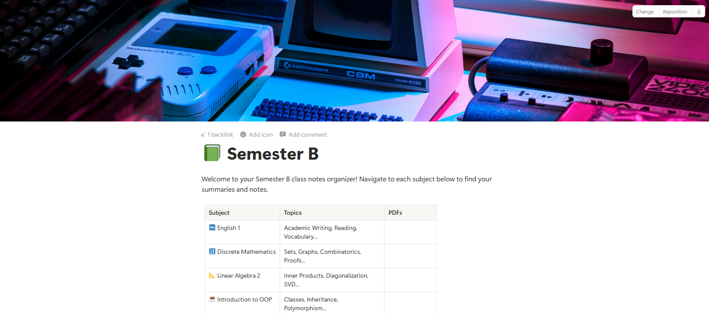

# MP4 Transcriber (Hebrew)

Turn long Hebrew MP4 recordings into text. Split oversized videos, transcribe
them with Whisper (locally or via the OpenAI API), and collect the resulting
`.txt` files in one folder — ready for you to upload anywhere you like (Notion,
Drive, Obsidian, whatever fits your workflow).

## How it works

```
big video.mp4  →  [video-splitter]  →  small parts  →  [transcription]  →  output/*.txt
```

1. **Split** — if your MP4s are large (e.g. >200MB), `video-splitter/split_videos.py`
   cuts them into smaller parts with `ffmpeg`.
2. **Transcribe** — `transcription/transcribe_local.py` (free, runs on your CPU)
   or `transcription/transcribe_openai.py` (uses the OpenAI Whisper API) turns
   each MP4 into a `.txt` transcript.
3. **Collect** — every transcript lands in one `output/` folder (mirroring your
   source folder structure), so you can grab the `.txt` files and upload them to
   Notion (or anywhere else) with whatever tool you prefer.

## Requirements

- Python 3.9+
- [ffmpeg](https://ffmpeg.org/download.html) on your `PATH` (needed by both the
  splitter and the OpenAI transcriber)
- Install Python deps:
  ```
  pip install -r transcription/requirements.txt
  ```

## 1. Split oversized videos (optional)

Skip this step if your MP4s are already small enough to transcribe directly.

```
python video-splitter/split_videos.py "C:/path/to/videos"
```

Splits any MP4 over 200MB into a `<name>/<name>_partNNN.mp4` folder next to it.
If a part still comes out oversized (keyframe alignment can overshoot), re-run
with `--fix` to split it further:

```
python video-splitter/split_videos.py "C:/path/to/videos" --fix
```

## 2. Transcribe

### Option A — Local (free, no API key, slower)

Uses [faster-whisper](https://github.com/SYSTRAN/faster-whisper) on your CPU.

```
python transcription/transcribe_local.py "C:/path/to/videos" --model medium
```

- `--model`: `tiny` | `base` | `small` | `medium` | `large-v3` (default: `medium`,
  bigger = more accurate but slower)
- `--output-dir`: where to write transcripts (default: `output/` at the project root)

### Option B — OpenAI Whisper API (paid, faster, no local GPU needed)

1. Copy `transcription/.env.example` to `transcription/.env` and add your key:
   ```
   OPENAI_API_KEY=sk-your-real-key
   ```
2. Run:
   ```
   python transcription/transcribe_openai.py "C:/path/to/videos"
   ```
   Optionally pass a custom output folder as a second argument:
   ```
   python transcription/transcribe_openai.py "C:/path/to/videos" "C:/path/to/transcripts"
   ```

This script automatically extracts audio, splits files over 25MB into chunks,
and stitches the resulting transcript back together.

Before it sends anything to OpenAI, it scans the audio length of the files that
still need transcripts and shows an estimated cost (Whisper API is billed per
minute) — you confirm with `y` before any API calls are made, so you won't
accidentally kick off a big, costly batch blind.

## 3. Use the transcripts

Both transcribers write `.txt` files into the `output/` folder (or wherever you
pointed `--output-dir` / the second argument), mirroring your source folder
structure. From there, upload them to Notion — or anywhere else — using
whichever tool you prefer (Notion's own importer, a sync app, drag-and-drop,
your own script, etc.). This project intentionally stops at "clean .txt files
in one place" so you stay free to pick your own destination.

## What to do with your transcripts

The pipeline stops at clean `.txt` files on purpose — here's what I do with mine:

- **Notion** — if you have a Notion account (or want to set one up for this), I'd
  highly recommend it. Feed the `.txt` files to any AI chat tool that connects to
  your Notion workspace, and it'll organize the transcripts for you automatically.

  
  

- **NotebookLM** — adding the `.txt` files as sources to a notebook is a great
  use too. More source material means more context for NotebookLM to work with,
  which makes its summaries, Q&A, and audio overviews noticeably more useful.

## Notes

- Both transcribers skip any MP4 whose `.txt` output already exists, so re-runs
  only process new files.
- `transcribe_local.py` defaults to Hebrew (`language=he`); change `LANGUAGE`
  at the top of the script for other languages.
- `transcribe_openai.py` reads `transcription/.env` for `OPENAI_API_KEY` — never
  commit that file (it's already in `.gitignore`).
